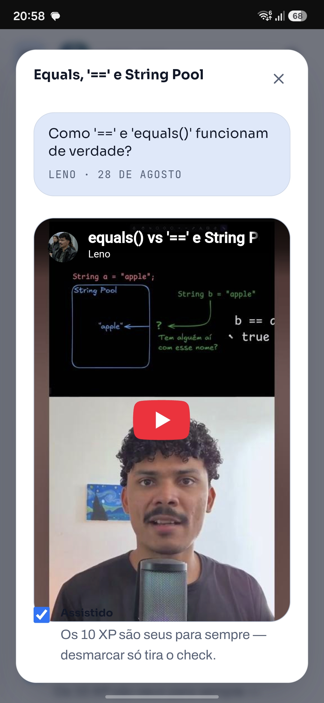

# Spec 024, fix: o cartão do membro derrubava a detecção de mudanças ao fechar

## O sintoma
Na passada de navegador com a pilha local completa (API em `localhost:3000` contra o projeto de
preview, front em `localhost:4200`), o diálogo da pergunta passou a **abrir vazio**: o `<dialog>`
abria, o rodapé aparecia, e o corpo ficava em branco.

O sinal do componente estava certo. Lido pelo devtools do Angular, `question()` tinha a pergunta
inteira, com título e corpo — a view é que não redesenhava.

A sequência que reproduz é exatamente a que a spec 024 criou:

1. abrir uma pergunta pelo cartão;
2. clicar no nome do autor, que fecha a pergunta e abre o cartão do membro (decisão 6);
3. fechar o cartão do membro;
4. abrir qualquer pergunta de novo. **Vazia.**

## A causa
`MemberCardDialog.onNativeClose` (spec 019) fazia:

```ts
this.member.set(null);
this.closed.emit();
```

`state` continuava valendo `'ready'`, então o `@default` do `@switch` — que lê `member()!.name` —
era reavaliado com `member` nulo e lançava `TypeError: Cannot read properties of null (reading
'name')` **dentro da detecção de mudanças**.

Em zoneless, o erro derruba o ciclo. E o preço não é pago onde o erro acontece: o cartão do membro
já estava fechado, ninguém olhava para ele, e quem parava de redesenhar era a **próxima** tela que
mudasse um sinal. Daí o diálogo da pergunta vazio, com o dado certo por baixo.

O defeito é anterior a esta spec e vive desde a 019. O que a 024 fez foi tornar comum um caminho que
antes era raro: abrir o cartão do membro, fechar e continuar usando a tela.

## A correção
Os dois sinais são um estado só, e separá-los foi o erro:

```ts
this.state.set('loading');
this.member.set(null);
this.closed.emit();
```

`'loading'` é o estado de abertura, e é para ele que fechar volta.

## O teste
`member-card-dialog.spec.ts` ganhou o teste-trava do fechamento: abre, recebe o membro, fecha, espera
o `close` nativo (que só chega no quadro seguinte) e exige que o cartão tenha voltado ao estado
inicial. **Verificado que ele falha sem a correção** — com a linha removida, o cartão continua na
tela com o membro anterior, porque o ciclo caiu.

## O que isto ensina para a próxima
Um `TypeError` lançado dentro de um template em zoneless **não é um erro local**. Ele não quebra só o
componente que o lançou: derruba o ciclo, e o sintoma aparece em outra tela, depois, sem relação
visível com a causa. Duas consequências práticas:

- O par "sinal de dado" e "sinal de estado" de um mesmo componente muda junto, sempre. Anular um e
  deixar o outro é o que cria a janela em que o template lê `!` sobre nulo.
- Quando uma tela para de redesenhar sem motivo, **o console é o primeiro lugar a olhar** — e o erro
  que interessa pode ter o nome de outro componente.

---

# Fix 2: o check "Já assisti" fica por cima do vídeo em retrato

> **Relatado por Leno, 2026-09-08.** No modal de vídeo de resposta na trilha, o check de marcar como
> assistido (e ganhar XP) fica **por cima do iframe** quando o vídeo é retrato (Short). Em paisagem
> não acontece, e **no desktop também não: é exclusivo do celular.**



## O que a captura mostra
O vídeo é pintado até depois do fim da caixa que a tela reservou para ele: a linha do check
("Assistido", com a caixa marcada) aparece **sobre a última faixa do vídeo**, e a frase dos 10 XP cai
logo abaixo, já fora do quadro. A moldura arredondada continua desenhada por baixo do check, o que
descarta a explicação mais simples — não é o vídeo que invadiu o check, é o layout que reservou
**menos altura do que o vídeo ocupa**.

O balão da pergunta e o título estão no lugar certo: o que escorregou foi só o par moldura/check, que
é exatamente onde as três specs se encontram.

## Onde isso mora
Três specs se encontram nesse ponto da tela, e nenhuma delas é a 024:

| Peça | Arquivo | Spec |
|---|---|---|
| O modal da resposta (`.resposta`, `.resposta__corpo`) | `pages/trilha/insignia/insignia.page.{html,scss}` | 021 |
| A moldura e a proporção (`.video__frame--retrato`) | mesma folha, linhas 81 a 127 | 017 |
| O check e o XP (`.visto`) | mesma folha, linhas 520 a 570 | 019 |

`.resposta__corpo` é `display: grid` de uma coluna, e a moldura e o check são **itens irmãos** —
numa grid de uma coluna dois irmãos não deveriam se sobrepor nunca. É essa contradição que o
conserto tem que explicar antes de mexer em qualquer linha.

## A hipótese principal, a verificar
Dentro do modal, a moldura do retrato recebe **três restrições que não podem valer ao mesmo tempo**:

```scss
.video__frame--retrato { aspect-ratio: 9 / 16; }            /* spec 017 */
.resposta .video__frame--retrato { width: 100%; max-height: 60dvh; }  /* spec 021 */
```

Com largura fixa em 100%, a altura que a proporção pede é `largura × 16 / 9` — em um modal de 26rem,
mais de 700px — e o `max-height` corta essa altura. Quando o navegador resolve o conflito pintando a
caixa com a altura da proporção mas **reservando na track da grid a altura do `max-height`** (ou o
contrário), o resultado na tela é exatamente o relatado: o vídeo desenhado passa por baixo do
próximo item, que é o check.

Isso explica por que só acontece em retrato: `--paisagem` só declara `aspect-ratio: 16 / 9`, sem teto
de altura, então não há conflito para o navegador desempatar.

### E por que só no celular
A conta fecha com os números do aparelho da captura. O modal é `min(26rem, 100vw - 2rem)`: num
telefone de ~390px dá ~361px, e menos os `1.25rem` de padding de cada lado a moldura fica com
~321px. A proporção 9/16 pede **~571px de altura**, e `60dvh` num viewport de ~850px corta em
**~510px**. A diferença, ~60px, é da ordem da faixa que o check cobre na imagem.

Há um segundo suspeito que **só existe no celular**, e ele precisa ser testado junto: `dvh` é
dinâmico. A barra do navegador recolhe ao rolar, `60dvh` muda de valor durante a interação, e uma
track de grid que não é recalculada nesse instante deixa exatamente esta assinatura — a caixa pintada
com um valor, o espaço reservado com outro. No desktop o `dvh` não se mexe, e essa é a diferença
mais óbvia entre os dois ambientes.

**Nada disso é conclusão — é a suspeita que a medição precisa confirmar ou derrubar.** A regra do
repositório vale aqui: traga a medida antes de acusar o CSS.

## Tarefas

- [] Task 01: **Reproduzir e medir, antes de corrigir.** Subir a pilha local (API + front), semear
  uma insígnia com um vídeo de resposta em Short, abrir o modal no Chrome e comparar, para a moldura
  e para o check: `getBoundingClientRect()`, `offsetHeight` e a altura da track da grid. A pergunta a
  responder é uma só: **a caixa pintada do vídeo é maior que o espaço que ela ocupa no layout?** Sem
  esse número, qualquer correção é palpite.
- [] Task 02: Repetir a medida em **paisagem** e no **vídeo fora do modal** (a lista da trilha, que
  usa `width: auto; max-height: 68vh`). Se a sobreposição aparecer também fora do modal, o defeito é
  da moldura da spec 017 e não do modal da 021 — e o conserto muda de lugar.
- [] Task 03: Medir em **360px e no desktop**, e **o celular é o caso que manda**: o defeito só
  aparece lá, então conserto verificado no desktop não prova nada. O retrato tem regras diferentes por
  media query (`max-height: 68vh` no celular, `width: min(22rem, 100%)` a partir de 48rem) e o modal
  sobrescreve as duas.
- [] Task 03b: Testar a hipótese do **`dvh` dinâmico**: medir moldura e check com a barra do
  navegador aberta, rolar até ela recolher e medir de novo, sem fechar o modal. Se a sobreposição
  aparecer ou mudar de tamanho nesse momento, a unidade dinâmica é a causa — e o conserto é trocá-la
  por uma estática, ou tirar o teto do eixo errado, nunca ajustar o número.
- [] Task 04: **Corrigir tirando a contradição, e não empilhando `z-index`.** A direção provável é
  deixar um eixo mandar e derivar o outro pela proporção: dar altura à moldura
  (`height: min(60dvh, …)`) e devolver `width: auto` com `max-width: 100%`, como já é fora do modal.
  **`z-index` no check seria o conserto errado** — ele esconderia a sobreposição sem devolver o
  espaço ao layout, e o vídeo continuaria maior do que a caixa que a tela reservou para ele.
- [] Task 05: Teste de regressão em `insignia.page.spec.ts`, medindo geometria em vez de olhar o
  CSS: com a resposta aberta em retrato, o topo do `.visto` tem que ficar **abaixo** do fundo do
  `.video__frame`. É a mesma forma da medida que a spec 024 usa no cartão, e é o que falha hoje.
- [] Task 06: Conferir que o balão da pergunta (spec 017) continua acima do vídeo e que o check
  segue com alvo de toque de 44px nos dois formatos — a correção mexe na caixa que os três dividem.
- [] Task 07: Nova passada de navegador nos dois formatos, com o vídeo tocando, **em viewport de
  celular de verdade** — o iframe de mesma origem que a spec 024 usou serve, e a rolagem que recolhe a
  barra precisa entrar no roteiro — e registro do resultado aqui embaixo.
